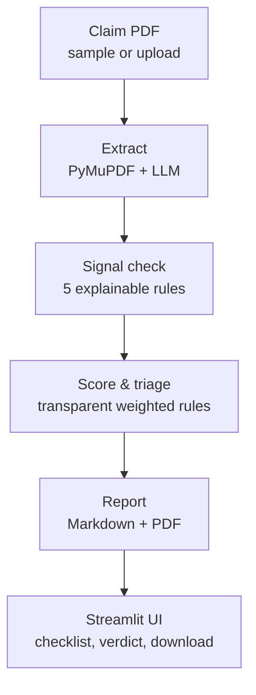
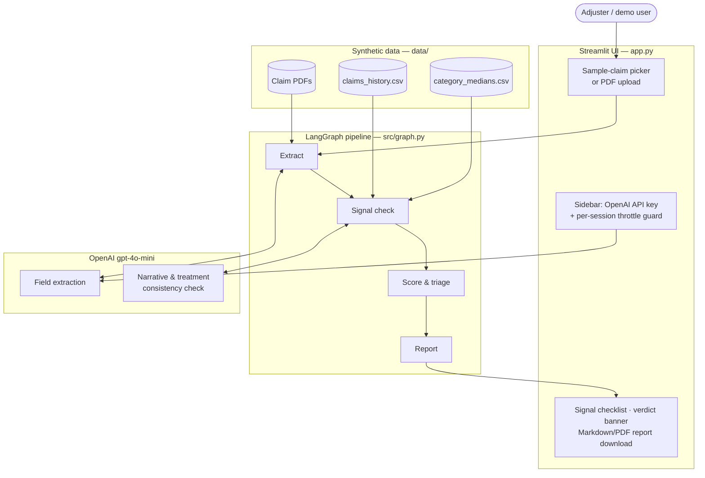

# Claims Copilot: Fraud Triage Agent

Upload a health insurance claim — an AI agent extracts the facts, scores fraud risk against explainable signals, and writes the one-page triage report an adjuster would want.

> ⚠️ **Decision-support demo only — not an underwriting or denial system.** A human adjuster makes the final call on every claim. All data in this project is **synthetic**: no real claimants, policies, insurers, or medical records.

## The problem

Adjusters manually triage thousands of claims a month. Fraud slips through when a reviewer is rushed; clean, low-risk claims sit in the same queue as genuinely suspicious ones and wait longer than they should. This project prototypes an agent that does the first pass: pull the facts out of the document, check them against a handful of explainable red flags, and hand the adjuster a triage recommendation with evidence attached — not a black-box score.

## Demo


🔗 **Live app:** [claims-copilot-fraud-triage-agent-kvrlaonnzuxr5msemgjg9t.streamlit.app](https://claims-copilot-fraud-triage-agent-kvrlaonnzuxr5msemgjg9t.streamlit.app)

Or see [Quickstart](#quickstart) to run it locally.

## How it works

A [LangGraph](https://github.com/langchain-ai/langgraph) pipeline runs four explicit nodes over every claim, sample or uploaded:



1. **Extract** — [PyMuPDF](https://pymupdf.readthedocs.io/) pulls raw text from the PDF; an LLM call (`gpt-4o-mini`) structures it into fields: claimant, policy number, dates, category, amount, diagnosis, treatment, narrative.
2. **Signal check** — the extracted fields are run against a synthetic claims-history table and five explainable fraud signals (below). Two of them require semantic judgment (narrative coherence, treatment-vs-diagnosis fit) and run as a single combined LLM call to keep cost predictable.
3. **Score & triage** — fired signals combine through fixed, published weights into a 0–100 risk score and one of three buckets: **AUTO-APPROVE / STANDARD REVIEW / INVESTIGATE**. Scores that land near a bucket boundary are flagged as borderline, prompting extra adjuster judgment.
4. **Report** — a one-page Markdown/PDF report: extracted facts table, each fired signal with an evidence quote pulled from the source document, the score, and the recommended action.

Nothing here is a trained model. Every signal and every weight is visible in [`src/signals.py`](src/signals.py) and [`src/scoring.py`](src/scoring.py) — that transparency is the point. A future version could swap the fixed weights for a trained model without touching the rest of the pipeline; v1 deliberately doesn't.

## Architecture



The UI, pipeline, data, and LLM calls are cleanly separated: `app.py` only handles rendering and user input, `src/graph.py` wires the four nodes together, and each node (`src/extraction.py`, `src/signals.py`, `src/scoring.py`, `src/report.py`) is independently testable — see `scripts/validate_*.py` for the checks run against all sample claims.

## Fraud signals

| Signal | Weight | What it checks | Why it matters |
|---|---|---|---|
| **Early claim** | 20 | Loss occurred within 30 days of the policy start date | Claims filed just after a policy starts carry higher non-disclosure/fraud risk — the classic "buy the policy, then claim" pattern |
| **High amount vs. category median** | 25 | Claimed amount is more than 2x the median for that claim category | An outsized claim for a routine category is worth a second look before it's paid |
| **Repeat claimant** | 20 | Claimant has ≥1 prior claim within the last 365 days | Repeat claimants aren't automatically denied, but the pattern deserves a closer read |
| **Narrative inconsistency** *(LLM)* | 30 | Incident narrative is internally inconsistent or vague on key facts (location, timeline, cause) | A story that doesn't hold together on its own terms is the single strongest tell an experienced adjuster looks for |
| **Treatment/diagnosis mismatch** *(LLM)* | 35 | Treatment is a fundamentally different kind of intervention than the diagnosis calls for | Routine care for the stated condition is normal, however it's described — an unexplained escalation (e.g. major surgery for a diagnosis that doesn't call for it) is not |

Score buckets: **0–19 → AUTO-APPROVE**, **20–59 → STANDARD REVIEW**, **60–100 → INVESTIGATE**. A score within 5 points of either boundary is flagged borderline in the report.

## Scope, on purpose

- **Health insurance claims only** — no motor, no other lines of business.
- **Synthetic data only** — 9 generated sample claims (mix of clean and suspicious) plus two edge-case PDFs (unparseable / no text layer), all fictional, from a fictional insurer.
- **5 signals, not more** — depth of explanation over signal count.
- No multi-language support, no image/photo analysis, no authentication.
- Same cost guard as always: user supplies their own OpenAI API key (sidebar, never stored) and calls are throttled per session.

## Stack

- **UI:** Streamlit
- **Agent framework:** [LangGraph](https://github.com/langchain-ai/langgraph) — extract → signal check → score & triage → report as explicit graph nodes
- **LLM:** OpenAI `gpt-4o-mini` via `langchain-openai`
- **PDF parsing:** PyMuPDF (text extraction), ReportLab (report generation)
- **Data:** synthetic claim PDFs + a CSV claims-history table (no database)

## Quickstart

Requires Python 3.11 and an OpenAI API key ([platform.openai.com](https://platform.openai.com)).

```bash
git clone https://github.com/AmbikeshMishra/claims-copilot-fraud-triage-agent.git
cd claims-copilot-fraud-triage-agent

python -m venv venv
venv\Scripts\activate        # Windows
# source venv/bin/activate   # macOS/Linux

pip install -r requirements.txt

# Generate the synthetic sample claim PDFs (first run only)
python scripts/generate_claim_pdfs.py
python scripts/generate_edge_case_pdfs.py

streamlit run app.py
```

Paste your OpenAI API key into the sidebar, pick a sample claim (or upload your own PDF), and click **Run triage**.

## Project structure

```
.
├── app.py                  Streamlit UI
├── src/
│   ├── graph.py            LangGraph pipeline (extract -> signal_check -> score_triage -> report)
│   ├── extraction.py       Extract node
│   ├── signals.py          Signal check node
│   ├── scoring.py          Score & triage node
│   ├── report.py           Report node (Markdown + PDF)
│   ├── schema.py           Extracted-claim data model
│   ├── pdf_text.py         Raw PDF text extraction
│   └── throttle.py         Per-session LLM call throttle
├── scripts/                One-off generators/validators for synthetic data
└── data/                   Synthetic claim PDFs, claims history, category medians
```

## About the author

I spent 6+ years in insurance analytics — building fraud models at Max Bupa and pricing models at TCS — before moving into applied AI. This project combines that domain background with an agentic pipeline to show what AI-assisted triage could look like in practice.

**[LinkedIn](https://www.linkedin.com/in/ambikesh-mishra-2775b91b/)** · **m.ambikesh@gmail.com**
